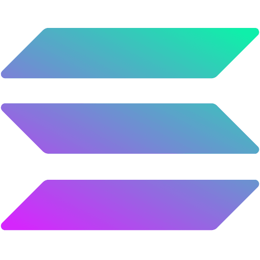
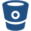

  

<h1 align="center">
  
  
  
  
</h1>

  

I am a passionate full stack web and mobile app developer and have been involved in commercial software development using a variety of skills for the past 9 years.
My passion for software is to dream ideas and bring them to life with elegant interfaces and I pay a lot of attention to the experience, architecture and code quality of what I build.
My experienced industries include E-Commerce, Real Estate, Education, Booking Systems(Hotel, Travel, Restaurant), Healthcare and Insurance, SAAS and so on.
I was actively involved in back-end development, front-end development, solutions architecture, DevOps engineering, full stack development, technical product management. 

<h1 align="center"></h1>

### 🛠 &nbsp;Tech Stack

<table align="center">
  <tr>
    <td></td>
    <td></td>
    <td></td>  
    <td></td>
    <td></td>
    <td></td>
    <td></td>
    <td></td>
    <td></td>
    <td></td>
    <td></td>  
    <td></td>
    <td></td>  
    <td></td> 
  </tr>
  <tr>
    <td></td>
    <td></td>
    <td></td>
    <td></td>
    <td></td>
    <td></td>
    <td></td>  
    <td></td>  
    <td></td>    
    <td></td>
    <td></td> 
    <td></td> 
    <td></td> 
    <td></td>
  </tr>
   <tr>    
    <td></td>
    <td></td>
    <td></td>
    <td></td>
    <td></td>   
    <td></td>
  </tr>  
</table>
